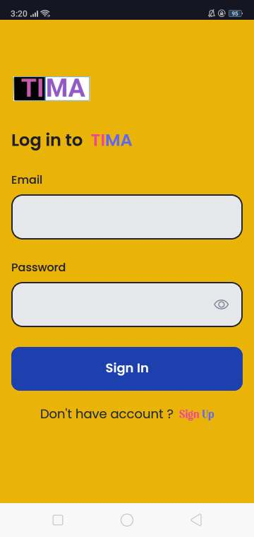

# TIMA
Tima Mobile App.

# Features
* Manage time and task
* Check your progress

# Course Overview
* Basic React Native Components
* Database Design using Appwrite
* User Registration & Authenticaiton
* Deployment

# Tech Stack
* React Native
* AppWrite
* HTML, CSS and JS

# Home Screen
  

# Sign Up Screen
  

# Sign In Screen
  

# Tabs Screen
  